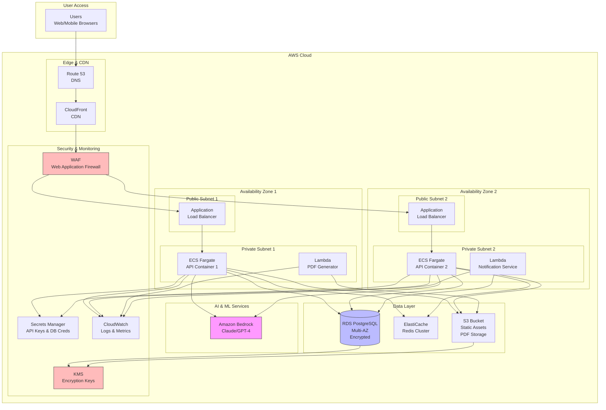
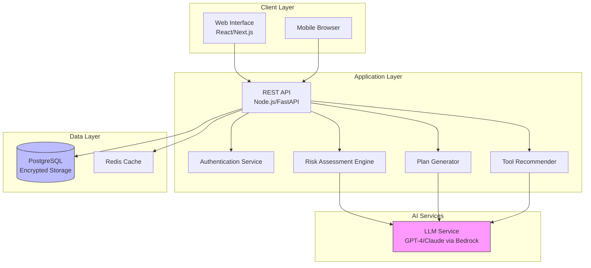
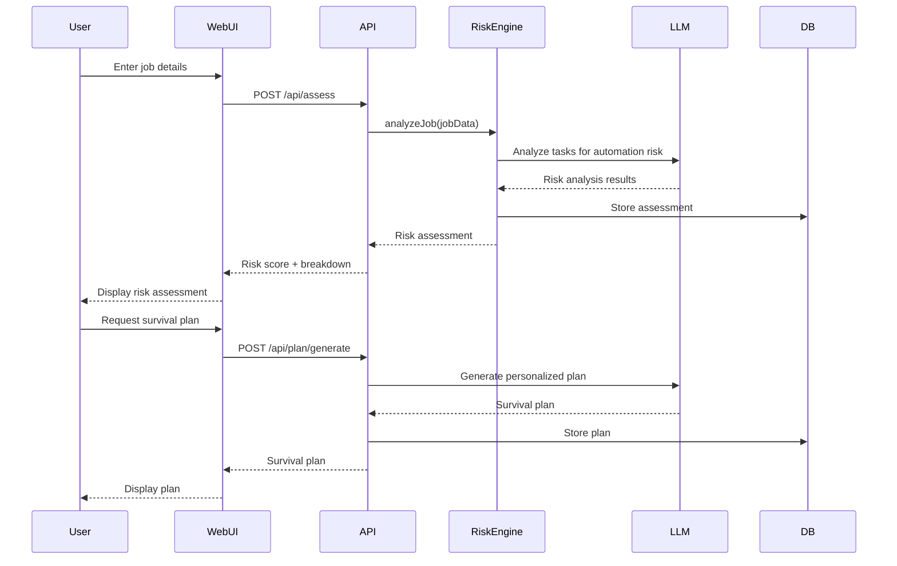

# Design Document: CareerShield AI

## Overview

CareerShield AI is a web-based application that provides AI-powered career risk assessment and personalized upskilling guidance. The system uses large language models (LLMs) to analyze job roles and tasks, assess automation risk, and generate actionable survival plans for working professionals.

The architecture follows a three-tier design:
1. **Presentation Layer**: Responsive web interface (React/Next.js)
2. **Application Layer**: REST API backend (Node.js/Express or Python FastAPI)
3. **Data Layer**: PostgreSQL database with encrypted user data storage

The system integrates with AI services (OpenAI GPT-4 or Claude via Amazon Bedrock) for intelligent analysis and plan generation, while maintaining strict data privacy and security standards.

## Architecture

### AWS Deployment Architecture



### AWS Services Breakdown

**Compute:**
- **ECS Fargate**: Serverless container orchestration for API backend (auto-scaling based on CPU/memory)
- **Lambda**: Serverless functions for PDF generation and notification services

**Storage:**
- **RDS PostgreSQL**: Multi-AZ deployment with automated backups, encryption at rest via KMS
- **ElastiCache Redis**: In-memory caching for session data and frequently accessed assessments
- **S3**: Static asset hosting (frontend build) and PDF storage with lifecycle policies

**Networking:**
- **CloudFront**: Global CDN for low-latency content delivery
- **Route 53**: DNS management with health checks and failover
- **Application Load Balancer**: Distributes traffic across ECS tasks with health checks
- **VPC**: Isolated network with public/private subnets across multiple AZs

**AI/ML:**
- **Amazon Bedrock**: Managed access to Claude or GPT-4 models for risk assessment and plan generation

**Security:**
- **WAF**: Protection against common web exploits (SQL injection, XSS)
- **Secrets Manager**: Secure storage for API keys, database credentials, encryption keys
- **KMS**: Encryption key management for data at rest
- **IAM**: Fine-grained access control for all AWS services

**Monitoring:**
- **CloudWatch**: Centralized logging, metrics, and alarms
- **X-Ray**: Distributed tracing for performance analysis

### High-Level Architecture



### Component Interaction Flow



## Components and Interfaces

### 1. Web Interface (Presentation Layer)

**Responsibilities:**
- Render responsive UI for all devices
- Handle user input and validation
- Display risk assessments and survival plans
- Manage client-side state and caching
- Support offline mode for viewing saved content

**Key Pages:**
- Landing page with quick assessment form
- Risk assessment results page
- Survival plan dashboard
- Progress tracker
- Account management

**Technology:** React with Next.js for server-side rendering, TailwindCSS for styling

### 2. REST API (Application Layer)

**Responsibilities:**
- Handle HTTP requests from clients
- Orchestrate business logic across services
- Enforce authentication and authorization
- Implement rate limiting
- Return structured JSON responses

**Key Endpoints:**

```typescript
// Assessment endpoints
POST   /api/assess              // Create new risk assessment
GET    /api/assess/:id          // Retrieve assessment
PUT    /api/assess/:id          // Update assessment

// Plan endpoints
POST   /api/plan/generate       // Generate survival plan
GET    /api/plan/:id            // Retrieve plan
GET    /api/plan/:id/export     // Export plan as PDF

// Tool recommendations
GET    /api/tools/recommend     // Get AI tool recommendations

// Progress tracking
POST   /api/progress/milestone  // Mark milestone complete
GET    /api/progress/:userId    // Get user progress

// User management
POST   /api/auth/register       // Create account
POST   /api/auth/login          // Authenticate user
GET    /api/user/profile        // Get user profile
PUT    /api/user/profile        // Update profile
DELETE /api/user/account        // Delete account
```

### 3. Risk Assessment Engine

**Responsibilities:**
- Analyze job titles and tasks for automation risk
- Calculate risk scores (Low/Medium/High)
- Identify AI-safe vs at-risk tasks
- Generate task-level risk breakdowns

**Interface:**

```typescript
interface RiskAssessmentEngine {
  analyzeJob(jobData: JobInput): Promise<RiskAssessment>;
  calculateRiskScore(tasks: Task[]): RiskScore;
  identifyAtRiskTasks(tasks: Task[]): Task[];
  identifyAISafeTasks(tasks: Task[]): Task[];
}

interface JobInput {
  jobTitle: string;
  companyType: string;
  dailyTasks: string[];
  industry?: string;
}

interface RiskAssessment {
  id: string;
  userId: string;
  overallRiskScore: 'Low' | 'Medium' | 'High';
  taskBreakdown: TaskRisk[];
  aiSafeTasks: string[];
  atRiskTasks: string[];
  generatedAt: Date;
}

interface TaskRisk {
  task: string;
  riskLevel: 'Low' | 'Medium' | 'High';
  automationLikelihood: number; // 0-100
  reasoning: string;
}
```

**Algorithm:**
1. Send job title and tasks to LLM with structured prompt
2. LLM analyzes each task for automation potential
3. Parse LLM response into structured risk data
4. Calculate overall risk score based on weighted task risks
5. Categorize tasks into AI-safe and at-risk buckets

### 4. Plan Generator

**Responsibilities:**
- Generate personalized 3-6 month upskilling roadmaps
- Map current skills to AI-augmented roles
- Create week-by-week learning plans with milestones
- Identify skill gaps and learning resources

**Interface:**

```typescript
interface PlanGenerator {
  generatePlan(assessment: RiskAssessment, userProfile: UserProfile): Promise<SurvivalPlan>;
  mapSkillsToRoles(currentSkills: string[]): AIAugmentedRole[];
  identifySkillGaps(currentSkills: string[], targetRole: string): SkillGap[];
  createLearningPath(skillGaps: SkillGap[]): LearningPath;
}

interface SurvivalPlan {
  id: string;
  userId: string;
  duration: number; // months
  targetRoles: AIAugmentedRole[];
  weeklyPlan: WeeklyMilestone[];
  skillGaps: SkillGap[];
  recommendedCourses: Course[];
  estimatedCompletionDate: Date;
}

interface WeeklyMilestone {
  week: number;
  goal: string;
  tasks: string[];
  estimatedHours: number;
  resources: Resource[];
}

interface SkillGap {
  skill: string;
  currentLevel: 'None' | 'Beginner' | 'Intermediate' | 'Advanced';
  requiredLevel: 'Beginner' | 'Intermediate' | 'Advanced' | 'Expert';
  priority: 'High' | 'Medium' | 'Low';
}

interface AIAugmentedRole {
  title: string;
  description: string;
  requiredSkills: string[];
  matchScore: number; // 0-100
  transitionDifficulty: 'Easy' | 'Moderate' | 'Challenging';
}
```

### 5. Tool Recommender

**Responsibilities:**
- Recommend specific AI tools for user's current role
- Generate prompt templates for recommended tools
- Create workflows for applying tools to specific tasks
- Identify quick wins for immediate implementation

**Interface:**

```typescript
interface ToolRecommender {
  recommendTools(jobData: JobInput, tasks: Task[]): Promise<ToolRecommendation[]>;
  generatePromptTemplates(tool: AITool, userTasks: Task[]): PromptTemplate[];
  identifyQuickWins(recommendations: ToolRecommendation[]): QuickWin[];
}

interface ToolRecommendation {
  tool: AITool;
  relevanceScore: number; // 0-100
  applicableTasks: string[];
  promptTemplates: PromptTemplate[];
  workflow: Workflow;
  implementationDifficulty: 'Easy' | 'Medium' | 'Hard';
}

interface AITool {
  name: string;
  category: string;
  description: string;
  url: string;
  pricingModel: 'Free' | 'Freemium' | 'Paid';
}

interface PromptTemplate {
  title: string;
  template: string;
  exampleInput: string;
  exampleOutput: string;
  applicableTask: string;
}

interface QuickWin {
  title: string;
  description: string;
  tool: AITool;
  estimatedTimeToImplement: number; // minutes
  expectedImpact: string;
  stepByStepGuide: string[];
}
```

### 6. Authentication Service

**Responsibilities:**
- Handle user registration and login
- Manage session tokens (JWT)
- Enforce password security requirements
- Support account deletion

**Interface:**

```typescript
interface AuthService {
  register(email: string, password: string): Promise<User>;
  login(email: string, password: string): Promise<AuthToken>;
  validateToken(token: string): Promise<User>;
  logout(token: string): Promise<void>;
  deleteAccount(userId: string): Promise<void>;
}

interface User {
  id: string;
  email: string;
  createdAt: Date;
  languagePreference: 'en' | 'hi';
}

interface AuthToken {
  token: string;
  expiresAt: Date;
  userId: string;
}
```

### 7. Progress Tracker

**Responsibilities:**
- Track milestone completion
- Calculate progress percentages
- Trigger reminder notifications
- Update risk assessments based on skill acquisition

**Interface:**

```typescript
interface ProgressTracker {
  markMilestoneComplete(userId: string, milestoneId: string): Promise<void>;
  getProgress(userId: string): Promise<UserProgress>;
  sendReminder(userId: string): Promise<void>;
  updateRiskAfterSkillGain(userId: string, newSkills: string[]): Promise<RiskAssessment>;
}

interface UserProgress {
  userId: string;
  planId: string;
  completedMilestones: string[];
  totalMilestones: number;
  percentComplete: number;
  lastActivityDate: Date;
  currentWeek: number;
}
```

## Data Models

### Database Schema

```sql
-- Users table
CREATE TABLE users (
  id UUID PRIMARY KEY DEFAULT gen_random_uuid(),
  email VARCHAR(255) UNIQUE NOT NULL,
  password_hash VARCHAR(255) NOT NULL,
  language_preference VARCHAR(2) DEFAULT 'en',
  created_at TIMESTAMP DEFAULT CURRENT_TIMESTAMP,
  last_login TIMESTAMP,
  deleted_at TIMESTAMP NULL
);

-- Job profiles table
CREATE TABLE job_profiles (
  id UUID PRIMARY KEY DEFAULT gen_random_uuid(),
  user_id UUID REFERENCES users(id) ON DELETE CASCADE,
  job_title VARCHAR(255) NOT NULL,
  company_type VARCHAR(100),
  industry VARCHAR(100),
  daily_tasks TEXT[] NOT NULL,
  created_at TIMESTAMP DEFAULT CURRENT_TIMESTAMP
);

-- Risk assessments table
CREATE TABLE risk_assessments (
  id UUID PRIMARY KEY DEFAULT gen_random_uuid(),
  user_id UUID REFERENCES users(id) ON DELETE CASCADE,
  job_profile_id UUID REFERENCES job_profiles(id),
  overall_risk_score VARCHAR(10) NOT NULL CHECK (overall_risk_score IN ('Low', 'Medium', 'High')),
  task_breakdown JSONB NOT NULL,
  ai_safe_tasks TEXT[],
  at_risk_tasks TEXT[],
  generated_at TIMESTAMP DEFAULT CURRENT_TIMESTAMP
);

-- Survival plans table
CREATE TABLE survival_plans (
  id UUID PRIMARY KEY DEFAULT gen_random_uuid(),
  user_id UUID REFERENCES users(id) ON DELETE CASCADE,
  assessment_id UUID REFERENCES risk_assessments(id),
  duration_months INTEGER NOT NULL,
  target_roles JSONB NOT NULL,
  weekly_plan JSONB NOT NULL,
  skill_gaps JSONB NOT NULL,
  recommended_courses JSONB,
  created_at TIMESTAMP DEFAULT CURRENT_TIMESTAMP
);

-- Tool recommendations table
CREATE TABLE tool_recommendations (
  id UUID PRIMARY KEY DEFAULT gen_random_uuid(),
  user_id UUID REFERENCES users(id) ON DELETE CASCADE,
  plan_id UUID REFERENCES survival_plans(id),
  tools JSONB NOT NULL,
  quick_wins JSONB NOT NULL,
  created_at TIMESTAMP DEFAULT CURRENT_TIMESTAMP
);

-- Progress tracking table
CREATE TABLE user_progress (
  id UUID PRIMARY KEY DEFAULT gen_random_uuid(),
  user_id UUID REFERENCES users(id) ON DELETE CASCADE,
  plan_id UUID REFERENCES survival_plans(id),
  completed_milestones JSONB DEFAULT '[]',
  current_week INTEGER DEFAULT 1,
  last_activity_date TIMESTAMP DEFAULT CURRENT_TIMESTAMP,
  UNIQUE(user_id, plan_id)
);

-- Notifications table
CREATE TABLE notifications (
  id UUID PRIMARY KEY DEFAULT gen_random_uuid(),
  user_id UUID REFERENCES users(id) ON DELETE CASCADE,
  type VARCHAR(50) NOT NULL,
  message TEXT NOT NULL,
  sent_at TIMESTAMP DEFAULT CURRENT_TIMESTAMP,
  read_at TIMESTAMP NULL
);

-- Create indexes for performance
CREATE INDEX idx_users_email ON users(email);
CREATE INDEX idx_job_profiles_user_id ON job_profiles(user_id);
CREATE INDEX idx_risk_assessments_user_id ON risk_assessments(user_id);
CREATE INDEX idx_survival_plans_user_id ON survival_plans(user_id);
CREATE INDEX idx_user_progress_user_id ON user_progress(user_id);
```

### Data Encryption

All sensitive user data (job details, tasks, assessments) will be encrypted at rest using AES-256 encryption. The encryption key will be stored in AWS Secrets Manager and rotated regularly.

```typescript
interface EncryptionService {
  encrypt(data: string): string;
  decrypt(encryptedData: string): string;
}
```


## Correctness Properties

*A property is a characteristic or behavior that should hold true across all valid executions of a system—essentially, a formal statement about what the system should do. Properties serve as the bridge between human-readable specifications and machine-verifiable correctness guarantees.*

### Property 1: Input Validation Completeness

*For any* incomplete job submission (missing job title, company type, or fewer than 3 tasks), the system should reject the submission and return specific validation error messages indicating which fields are incomplete.

**Validates: Requirements 1.2**

### Property 2: Risk Assessment Structure Completeness

*For any* valid job submission, the generated risk assessment should contain: (1) an overall risk score of Low, Medium, or High, (2) a risk analysis for each submitted task, (3) categorization of tasks into at-risk and AI-safe groups, and (4) all tasks should appear in exactly one category.

**Validates: Requirements 2.1, 2.2, 2.3, 2.5**

### Property 3: Data Encryption at Rest

*For any* user data stored in the database (job profiles, risk assessments, survival plans), the stored representation should be encrypted and not readable as plaintext.

**Validates: Requirements 2.6, 7.1**

### Property 4: Survival Plan Structure Completeness

*For any* generated survival plan, it should contain: (1) a duration between 3-6 months, (2) at least one target AI-augmented role, (3) a week-by-week learning plan with milestones, (4) identified skill gaps with recommendations for filling them, and (5) suggested courses or certifications.

**Validates: Requirements 3.2, 3.3, 3.4, 3.5, 3.6**

### Property 5: Tool Recommendation Completeness

*For any* generated survival plan, the tool recommendations should include: (1) at least 3 specific AI tools, (2) prompt templates for each recommended tool, (3) workflows for applying each tool, (4) at least one quick win, and (5) guidance on demonstrating AI adoption.

**Validates: Requirements 4.1, 4.2, 4.3, 4.4, 4.5**

### Property 6: Skill Mapping Completeness

*For any* user profile analysis, the skill bridge mapping should include: (1) at least 2 AI-era role recommendations, (2) specific role titles for each recommendation, (3) identified skill gaps for each target role, (4) specific recommendations for filling each skill gap, and (5) relevant certifications for each target role.

**Validates: Requirements 5.1, 5.2, 5.3, 5.4, 5.5**

### Property 7: Progress Tracking Updates

*For any* milestone completion event, the system should: (1) update the user's progress tracker to include the completed milestone, (2) recalculate the percentage completion, and (3) display a celebration message to the user.

**Validates: Requirements 6.1, 6.3, 6.5**

### Property 8: Risk Assessment Update After Skill Gain

*For any* user who gains new skills, if a new risk assessment is generated, the risk score should be equal to or lower than the previous assessment (assuming the same job role), reflecting the reduced automation risk from upskilling.

**Validates: Requirements 6.4**

### Property 9: Account Deletion Completeness

*For any* user account deletion request, after deletion completes, all associated data (job profiles, risk assessments, survival plans, progress records, notifications) should be removed from the database and no longer retrievable.

**Validates: Requirements 7.5**

### Property 10: Accessibility Compliance

*For any* rendered UI component, all interactive elements should have appropriate ARIA labels, semantic HTML tags, and keyboard navigation support to ensure screen reader compatibility.

**Validates: Requirements 8.4**

### Property 11: High Contrast Mode Compliance

*For any* UI element displayed in high contrast mode, the color contrast ratio between text and background should meet or exceed WCAG 2.1 AA standards (4.5:1 for normal text, 3:1 for large text).

**Validates: Requirements 8.5**

### Property 12: PDF Export Completeness

*For any* survival plan export to PDF, the generated PDF should contain all plan sections including: overview, target roles, weekly milestones, skill gaps, tool recommendations, and course suggestions.

**Validates: Requirements 9.1, 9.3**

### Property 13: Offline Data Caching

*For any* user who loads their survival plan while online, the plan data should be cached locally and remain accessible when the user goes offline.

**Validates: Requirements 9.2, 9.4**

### Property 14: Language Consistency

*For any* user with a selected language preference, all generated content (risk assessments, survival plans, UI text) should be presented in that language, and the preference should persist across sessions.

**Validates: Requirements 10.2, 10.3, 10.4**

### Property 15: Rate Limiting Enforcement

*For any* user or IP address making requests, if the number of requests exceeds the configured rate limit within the time window, subsequent requests should be rejected with a 429 (Too Many Requests) status code until the window resets.

**Validates: Requirements 11.4**

### Property 16: User Data Retrieval on Login

*For any* authenticated user login, the system should retrieve and return all associated data including their most recent survival plan, progress tracker state, and risk assessment history.

**Validates: Requirements 12.3**

### Property 17: Assessment History Preservation

*For any* user who updates their job profile and generates a new risk assessment, all previous risk assessments should remain stored and accessible in the user's assessment history.

**Validates: Requirements 12.5**

### Property 18: Job Profile Update and Regeneration

*For any* user who updates their job information (title, company type, or tasks), the system should allow generation of a new risk assessment based on the updated information while preserving the old assessment in history.

**Validates: Requirements 12.4**

## Error Handling

### Error Categories

**1. User Input Errors**
- Invalid or incomplete job information
- Malformed email addresses
- Weak passwords
- Invalid language selection

**Response Strategy:** Return 400 Bad Request with specific validation error messages in the user's preferred language.

**2. Authentication Errors**
- Invalid credentials
- Expired tokens
- Unauthorized access attempts

**Response Strategy:** Return 401 Unauthorized or 403 Forbidden with generic error messages (avoid revealing whether email exists).

**3. AI Service Errors**
- LLM API timeout
- LLM API rate limiting
- Malformed LLM responses
- LLM service unavailable

**Response Strategy:** 
- Implement retry logic with exponential backoff (max 3 retries)
- Return 503 Service Unavailable if retries fail
- Log errors for monitoring
- Provide user-friendly message: "We're experiencing high demand. Please try again in a moment."

**4. Database Errors**
- Connection failures
- Query timeouts
- Constraint violations
- Encryption/decryption failures

**Response Strategy:**
- Implement connection pooling and retry logic
- Return 500 Internal Server Error
- Log detailed error information
- Provide generic user message: "Something went wrong. Please try again."

**5. Rate Limiting Errors**
- Too many requests from single user/IP

**Response Strategy:**
- Return 429 Too Many Requests
- Include Retry-After header
- Message: "Too many requests. Please wait before trying again."

### Error Response Format

```typescript
interface ErrorResponse {
  error: {
    code: string;
    message: string;
    details?: Record<string, string>;
    timestamp: string;
  };
}
```

### Graceful Degradation

- If LLM service is unavailable, show cached example assessments with disclaimer
- If database is slow, show loading states and allow cancellation
- If export to PDF fails, offer plain text download alternative
- If offline mode, clearly indicate which features require connectivity

## Testing Strategy

### Dual Testing Approach

The testing strategy employs both unit tests and property-based tests to ensure comprehensive coverage:

- **Unit tests** verify specific examples, edge cases, and error conditions
- **Property-based tests** verify universal properties across all inputs
- Together, they provide comprehensive coverage where unit tests catch concrete bugs and property tests verify general correctness

### Property-Based Testing

**Framework:** fast-check (for TypeScript/JavaScript) or Hypothesis (for Python)

**Configuration:**
- Minimum 100 iterations per property test
- Each test tagged with format: **Feature: career-shield-ai, Property {number}: {property_text}**

**Property Test Coverage:**

1. **Input Validation (Property 1)**
   - Generate random incomplete job submissions
   - Verify rejection and specific error messages

2. **Risk Assessment Structure (Property 2)**
   - Generate random valid job submissions
   - Verify assessment contains all required components
   - Verify tasks are categorized correctly

3. **Data Encryption (Property 3)**
   - Generate random user data
   - Store and retrieve from database
   - Verify stored data is encrypted

4. **Survival Plan Structure (Property 4)**
   - Generate random risk assessments
   - Verify generated plans contain all required sections
   - Verify duration is within 3-6 month range

5. **Tool Recommendations (Property 5)**
   - Generate random job profiles
   - Verify tool recommendations meet all requirements

6. **Skill Mapping (Property 6)**
   - Generate random user profiles
   - Verify skill mappings contain all required elements

7. **Progress Tracking (Property 7)**
   - Generate random milestone completions
   - Verify progress updates correctly

8. **Risk Reduction After Upskilling (Property 8)**
   - Generate random skill acquisitions
   - Verify risk scores decrease or stay same

9. **Account Deletion (Property 9)**
   - Generate random user accounts with data
   - Delete and verify complete removal

10. **Accessibility (Property 10)**
    - Generate random UI components
    - Verify ARIA labels and semantic HTML

11. **Contrast Ratios (Property 11)**
    - Generate random UI elements in high contrast mode
    - Verify WCAG compliance

12. **PDF Export (Property 12)**
    - Generate random survival plans
    - Export to PDF and verify completeness

13. **Offline Caching (Property 13)**
    - Generate random plans
    - Verify caching and offline access

14. **Language Consistency (Property 14)**
    - Generate content in different languages
    - Verify consistency and persistence

15. **Rate Limiting (Property 15)**
    - Generate excessive requests
    - Verify rate limiting enforcement

16. **Login Data Retrieval (Property 16)**
    - Generate random user accounts with data
    - Login and verify data retrieval

17. **Assessment History (Property 17)**
    - Generate multiple assessments
    - Verify history preservation

18. **Profile Update (Property 18)**
    - Generate profile updates
    - Verify new assessment generation and history preservation

### Unit Testing

**Framework:** Jest (for TypeScript/JavaScript) or pytest (for Python)

**Unit Test Focus Areas:**

1. **Authentication Service**
   - Valid login with correct credentials
   - Login rejection with incorrect credentials
   - Password hashing security
   - Token expiration handling
   - Account deletion edge cases

2. **Risk Assessment Engine**
   - Specific job examples (QA tester, business analyst, developer)
   - Edge case: job with all high-risk tasks
   - Edge case: job with all low-risk tasks
   - Edge case: single task job
   - LLM response parsing errors

3. **Plan Generator**
   - Specific risk assessment examples
   - Edge case: user with no existing skills
   - Edge case: user already in AI-augmented role
   - Milestone generation logic

4. **Tool Recommender**
   - Specific job role examples
   - Edge case: niche job roles
   - Prompt template generation

5. **Progress Tracker**
   - First milestone completion
   - Last milestone completion (100% progress)
   - Milestone completion out of order

6. **API Endpoints**
   - Valid request/response cycles
   - Missing authentication tokens
   - Invalid request payloads
   - CORS handling

7. **Database Operations**
   - CRUD operations for each entity
   - Cascade deletion on account removal
   - Concurrent update handling

8. **PDF Export**
   - Valid plan export
   - Edge case: plan with minimal data
   - Edge case: plan with maximum data

9. **Language Support**
   - English content generation
   - Hindi content generation
   - Language switching

10. **Error Handling**
    - LLM timeout scenarios
    - Database connection failures
    - Invalid encryption keys

### Integration Testing

**Focus Areas:**

1. **End-to-End User Flows**
   - Complete onboarding → assessment → plan generation → account creation
   - Login → view plan → mark milestone → view progress
   - Update profile → regenerate assessment → view history

2. **External Service Integration**
   - LLM API integration (with mocked responses for CI/CD)
   - Database connection pooling
   - Cache invalidation

3. **Security Testing**
   - SQL injection attempts
   - XSS attack prevention
   - CSRF protection
   - Rate limiting effectiveness

### Performance Testing

**Tools:** Apache JMeter or k6

**Test Scenarios:**

1. Load test: 1000 concurrent users
2. Stress test: Gradual increase to failure point
3. Spike test: Sudden traffic surge
4. Endurance test: Sustained load over 1 hour

**Performance Targets:**
- Page load: < 2 seconds
- API response: < 3 seconds
- Risk assessment generation: < 2 minutes
- 95th percentile response time: < 5 seconds

### Accessibility Testing

**Tools:** axe-core, WAVE, Lighthouse

**Manual Testing:**
- Screen reader testing (NVDA, JAWS)
- Keyboard-only navigation
- High contrast mode verification
- Mobile responsiveness

### Test Coverage Goals

- Unit test coverage: > 80%
- Property test coverage: All 18 properties
- Integration test coverage: All critical user flows
- Accessibility: WCAG 2.1 AA compliance

### Continuous Integration

- Run all unit tests on every commit
- Run property tests on every pull request
- Run integration tests before deployment
- Run performance tests weekly
- Run accessibility audits before releases
